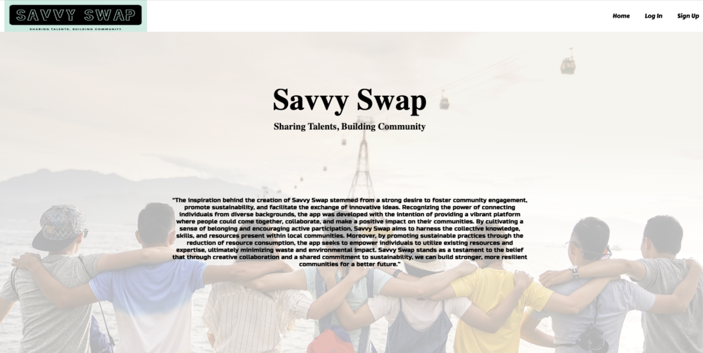
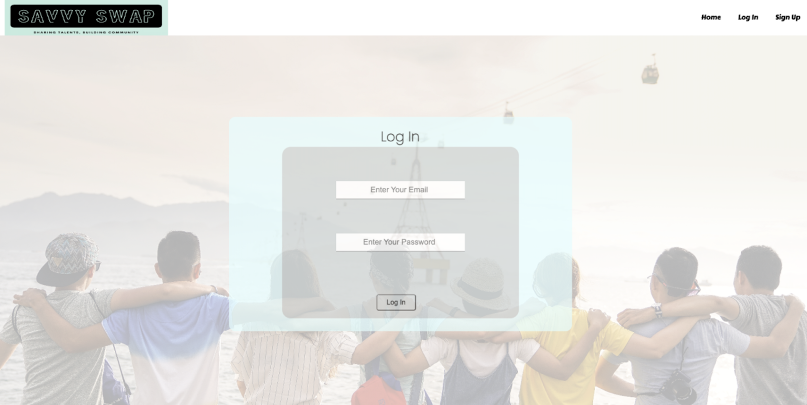

# neighborhood-hack-frontend
## Overview

This repository contains the frontend code for the Neighborhood Hack application. Neighborhood Hack is a web application aimed at connecting individuals within a community and fostering collaboration and resource sharing. The frontend is built using modern web technologies to provide a user-friendly and interactive experience.

## Installation
To run the Neighborhood Hack frontend locally, follow these steps:

1. Clone this repository to your local machine.

    `git clone https://github.com/LeeReyesCS/neighborhood-hack-frontend.git`

2. Navigate to the project directory.

    `cd neighborhood-hack-frontend`
    
3. Install the required dependencies using yarn.

    `yarn install`

4. Start the development server.
    `yarn start`
    
5. Open your browser and visit http://localhost:3000 to access the Neighborhood Hack application.

## Features

**User Authentication**: Users can create accounts, log in, and securely authenticate their identity.

**Community Connection**: Connect with other users within the neighborhood and collaborate on various projects.

**Resource Sharing**: Share resources, skills, and expertise with other members of the community.

**Interactive Interface**: Enjoy a user-friendly and intuitive interface to navigate and interact with the application.

**Real-time Updates**: Receive real-time updates on community activities, projects, and notifications.

**Responsive Design**: The application is designed to be responsive and accessible on various devices.

## Technologies Used

The Neighborhood Hack frontend is built using the following technologies:

**React**: A popular JavaScript library for building user interfaces.

**HTML**: The standard markup language for creating web pages.

**CSS**: The styling language used to design the visual presentation of the application.

**JavaScript**: The programming language used to add interactivity and functionality to the frontend.

**Axios**: A library for making HTTP requests to the backend API.

**React Router**: A routing library for managing navigation within the application.

